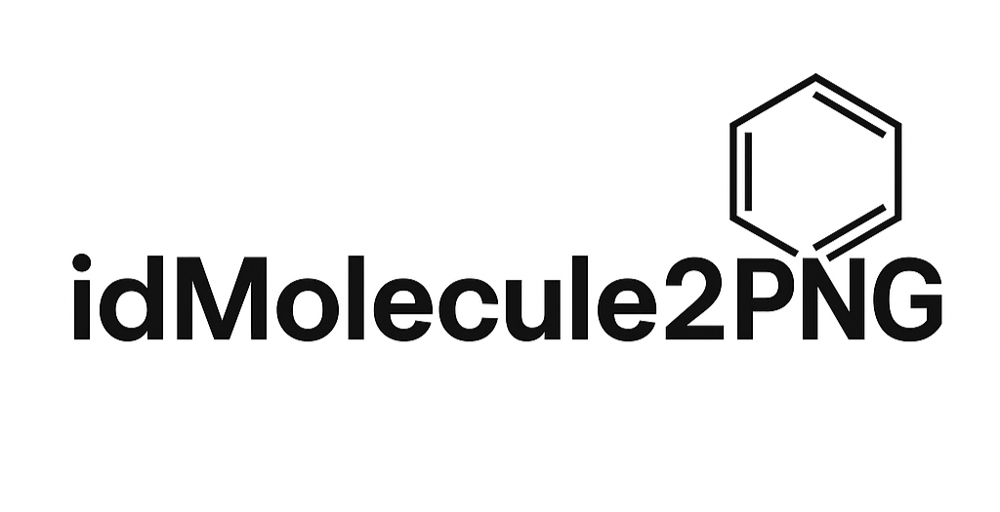

# idMolecule2PNG

> **Convierte identificadores químicos (CAS, ChEMBL o SMILES) en imágenes PNG con un clic.**
> *Powered by Streamlit + RDKit.*



---

## 🚀 Demo en vivo

👉 [https://idmolecule2png-streamlit.streamlit.app](https://idmolecule2png-streamlit.streamlit.app)

Carga un identificador, elige fondo **Blanco** o **Transparente** y descarga la molécula renderizada en 400 × 400 px.

---

## ✨ Características

* **Resolución de identificadores** → SMILES usando:

  * PubChem (para CAS)
  * ChEMBL (para IDs *CHEMBLxxxxx*)
  * SMILES directos
* **Renderizado RDKit** a PNG (400 × 400 px).
* **Fondo blanco/transparente** a elección.
* **Descarga inmediata** (*mol.png*).
* Arquitectura minimalista: sólo `streamlit`, `rdkit-pypi`, `requests`.

---

## 📦 Instalación local

```bash
# 1 – clona el repo
$ git clone https://github.com/triptalabs/idMolecule2PNG-streamlit.git
$ cd idMolecule2PNG-streamlit

# 2 – crea / activa entorno virtual
$ python -m venv .venv
$ source .venv/bin/activate      # Linux/macOS
# .\.venv\Scripts\Activate.ps1   # Windows

# 3 – instala dependencias runtime
$ pip install -r requirements.txt

# 4 – lanza Streamlit
$ streamlit run ui.py
```

Abre [http://localhost:8501](http://localhost:8501) en tu navegador.

---

## 🛠 Desarrollo

> Herramientas opcionales para mantener el código limpio.

```bash
# dependencias de desarrollo
$ pip install -r requirements-dev.txt

# hooks de calidad
$ pre-commit install
# prueba rápida
$ pytest -q
```

### Estructura 🚂

```
├─ mol2png/          # lógica de negocio
│  ├─ __init__.py
│  ├─ resolver.py    # fetch_smiles()
│  ├─ draw.py        # mol_to_png_bytes()
│  └─ config.py
│
├─ ui.py             # lanzador Streamlit
├─ requirements.txt  # deps runtime
├─ requirements-dev.txt
└─ runtime.txt       # fija Python 3.11 en Streamlit Cloud
```

---

## 📄 API interna

| Función                                                                     | Descripción                                       |
| --------------------------------------------------------------------------- | ------------------------------------------------- |
| `fetch_smiles(identifier: str) -> str`                                      | Resuelve CAS / ChEMBL / SMILES a SMILES canónico. |
| `mol_to_png_bytes(smiles: str, size=(400,400), transparent=False) -> bytes` | Devuelve imagen PNG en memoria.                   |

---

## 🌐 Despliegue en Streamlit Cloud

1. **Fork / push** el repo a tu cuenta.
2. En *Streamlit Community Cloud* → **“New app”**.
3. Selecciona rama **main** y archivo **`ui.py`** como *Main file*.
4. ¡Click → Deploy!  Streamlit usará `requirements.txt` y `runtime.txt`.

---

## 🤝 Contribuciones

Los *pull requests* son bienvenidos. Para cambios mayores, abre primero un issue explicando lo que deseas modificar.

1. Haz un *fork* del proyecto.
2. Crea tu rama (`git checkout -b feat/nueva-funcionalidad`).
3. *Commit* → `git commit -m "feat: describe tu cambio"`.
4. *Push* → `git push origin feat/nueva-funcionalidad`.
5. Abre un *Pull Request*.

---

## 📝 Licencia

Distribuido bajo licencia **MIT**. Consulta el archivo [`LICENSE`](./LICENSE) para más información.

---

## 🙌 Agradecimientos

* [**RDKit**](https://www.rdkit.org/) – química en Python.
* [**Streamlit**](https://streamlit.io/) – apps de datos en minutos.
* [**PubChem**](https://pubchem.ncbi.nlm.nih.gov/) y [**ChEMBL**](https://www.ebi.ac.uk/chembl/) – datos químicos abiertos.

> Proyecto creado con 💡 por **Tripta Labs**.
